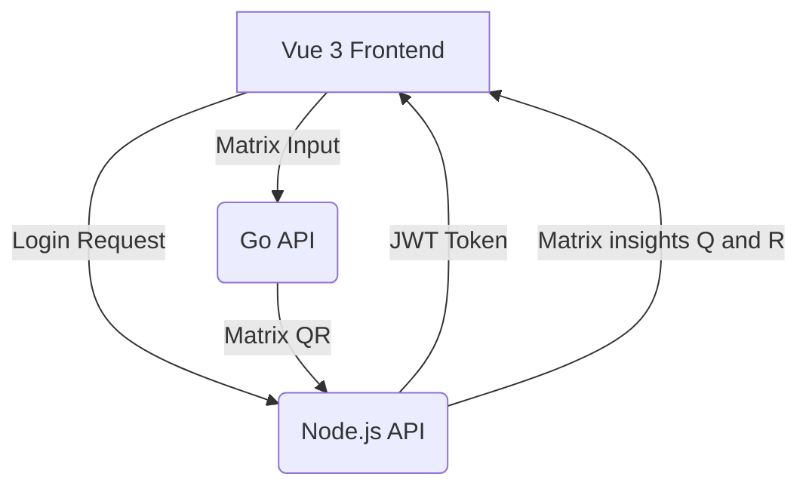

# 🔗 Fullstack App: Node API, Go API & Vue 3 Frontend

This project contains:

- ✅ A Node.js API (`/api/node`)
- ✅ A Go API (`/api/go`)
- ✅ A Vue 3 frontend (with login and token-based auth)

---

## 🧭 Project Structure


## 🗂️ Folder Structure
```
/api
  /node      → Node.js Express API (auth)
/api
  /go        → Go API for matrix parsing
/frontend
  /vue       → Vue 3 app with Composition API and auth
```
## Instructions
1. Start Node project:
```
 -> pnpm run dev
```
2. Start Go project:
```
 -> go run cmd/main.go
```
4. Start Vue project frontend:
```
 -> pnpm run dev
```


## 🔧 Vue Login Flow

- ✅ Uses a useAuth composable
- ✅ Calls login from authApi.js
- ✅ Stores JWT in localStorage
- ✅ Checks token expiration

## 🛠️ Technologies

🟢 Node.js + Express
🟡 Go (net/http)
🟣 Vue 3 + Composition API + Vite
🔐 JWT Auth
