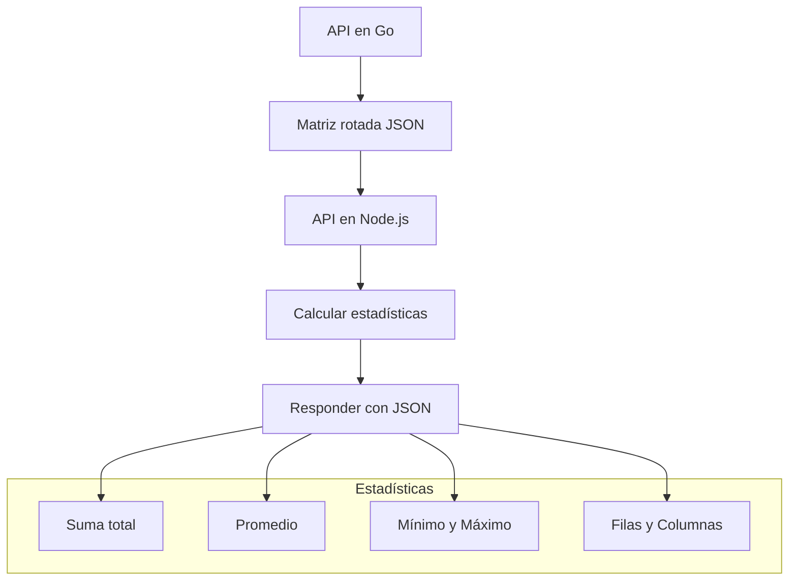
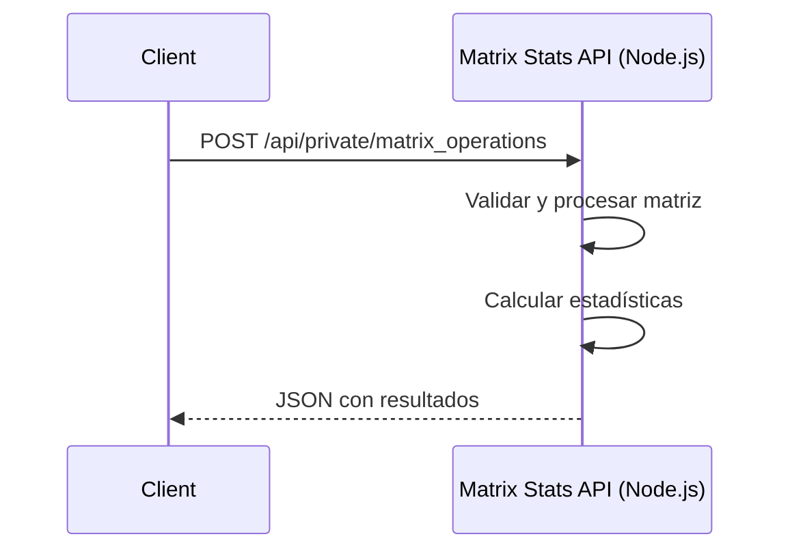
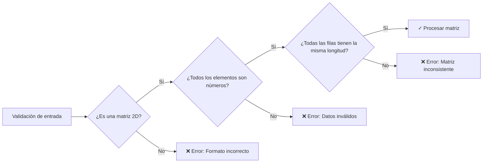

# 📊 Matrix Stats API (Node.js)

Esta API en Node.js recibe una **matriz rotada** desde una API escrita en Go, calcula estadísticas útiles y devuelve los resultados en formato JSON.

---

## 📦 Diagrama General de Flujo

## 📡 Endpoint REST

## ✅ Validaciones
