# 📊 Matrix Stats API (Node.js)

Esta API en Node.js recibe una **matriz rotada** desde una API escrita en Go, calcula estadísticas útiles y devuelve los resultados en formato JSON.

---

## 📦 Diagrama General de Flujo

```mermaid
flowchart TD
    A[API en Go] --> L[Matriz rotada JSON]
    L --> B[API en Node.js]
    B --> C[Calcular estadísticas]
    C --> D[Responder con JSON]

    D --> E[Suma total]
    D --> F[Promedio]
    D --> G[Mínimo y Máximo]
    D --> H[Filas y Columnas]

    subgraph Estadísticas
        E
        F
        G
        H
    end
```

## 📡 Endpoint REST


## ✅ Validaciones

```mermaid
graph LR
    A[Validación de entrada] --> B{¿Es una matriz 2D?}
    B -- Sí --> C{¿Todos los elementos son números?}
    C -- Sí --> D{¿Todas las filas tienen la misma longitud?}
    D -- Sí --> E[✓ Procesar matriz]
    B -- No --> F[❌ Error: Formato incorrecto]
    C -- No --> G[❌ Error: Datos inválidos]
    D -- No --> H[❌ Error: Matriz inconsistente]
```
